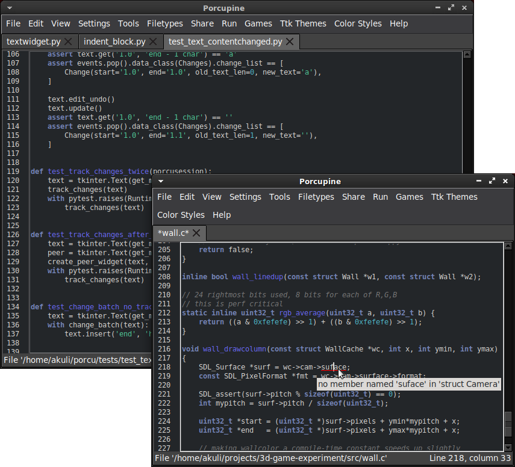

# Porcupine

Porcupine is a simple and beginner-friendly editor. If you ever used anything
like Notepad, Microsoft Word or LibreOffice Writer before, you will feel right
at home. All features of Porcupine should work great on Windows, Linux and Mac
OSX.

Here's a list of the most important features:

- Syntax highlighting with [Pygments][] (supports many programming languages
  and color themes, extensible)
- Some filetype specific settings
- Compiling files inside the editor window
- Running files in a separate terminal or command prompt window
- Autocompleting with tab
- Automatic indenting and trailing whitespace stripping when Enter is pressed
- Indent/dedent block with Tab and Shift+Tab
- Commenting/uncommenting multiple lines by selecting them and typing a #
- Line numbers
- Line length marker
- Find/replace
- Simple setting dialog
- Multiple files can be opened at the same time like tabs in a web browser
- The tabs can be dragged out of the window to open a new Porcupine window
  conveniently
- Status bar that shows current line and column numbers

[Pygments]: http://pygments.org/

Porcupine also has [a very powerful plugin
API](https://akuli.github.io/porcupine/), and most of the above features are
implemented as plugins. This means that if you know how to use Python 3 and
tkinter, you can easily customize your editor to do anything you want to. In
fact, the plugin API is so powerful that if you run Porcupine without plugins,
it shows up as an empty window!

## Installing Porcupine

There are [more detailed instructions on Porcupine
Wiki](https://github.com/Akuli/porcupine/wiki/Installing-and-Running-Porcupine).

### Debian-based Linux distributions (e.g. Ubuntu, Mint)

Open a terminal and run these commands:

    sudo apt install python3-tk python3-pip
    python3 -m pip install --user http://goo.gl/SnlfHw
    python3 -m porcupine &

### Other Linux distributions

Install Python 3.4 or newer with pip and tkinter somehow. Then run this
command:

    python3 -m pip install --user http://goo.gl/SnlfHw
    python3 -m porcupine &

### Mac OSX

I don't have a Mac. If you have a Mac, you can help me a lot by installing
Porcupine and letting me know how well it works.

I think you can download Python with tkinter from
[python.org](https://www.python.org/) and then run the commands for
"other Linux distributions" above.

### Windows

Install Python 3.4 from [python.org](https://www.python.org/). Make sure that
the "Install launchers for all users" box gets checked and tkinter gets
installed. Then open PowerShell or command prompt, and run these commands:

    py -m pip install --user http://goo.gl/SnlfHw
    pyw -m porcupine

### Development Install

If you want to do changes to Porcupine yourself, I recommend installing git and
then downloading Porcupine like this:

    git clone https://github.com/Akuli/porcupine
    cd porcupine
    python3 -m pip install -r requirements.txt
    python3 -m porcupine

Use `py` instead of `python3` on Windows.

## FAQ

### Help! Porcupine doesn't work.
Please [update Porcupine](https://github.com/Akuli/porcupine/wiki/Installing-and-Running-Porcupine#updating-porcupine).
If it still doesn't work, [let me know by creating an issue on
GitHub](http://github.com/Akuli/porcupine/issues/new).

### Why not use editor X?
Because Porcupine is better.

### I want an editor that does X, but X is not in the feature list above. Does Porcupine do X?
Maybe it can, see [the more_plugins directory](more_plugins/). If you don't
find what you are looking for you can write your own plugin, or alternatively,
you can [create an issue on GitHub](https://github.com/Akuli/porcupine/issues/new)
and hope that I feel like writing the plugin for you.

### Is Porcupine based on IDLE?
Of course not. IDLE is an awful mess that you should stay far away from.

### Why did you create a new editor?
Because I can.

### Why did you create a new editor in tkinter?
Because I can.

### How does feature X work?
See [porcupine/](porcupine/)X.py or [porcupine/plugins/](porcupine/plugins/)X.py.

### Can I play tetris with Porcupine?
Of course, just install the tetris plugin. See [more_plugins](more_plugins/).

### Is Porcupine an Emacs?
Not by default, but you can [install more plugins](more_plugins/).
